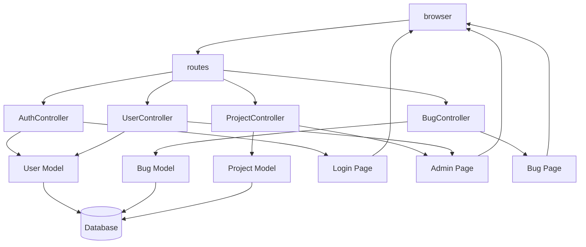

# mvc architecture diagram

```mermaid
graph TB
    browser[browser]
    
    routes[routes]
    
    AuthController[AuthController]
    BugController[BugController]
    ProjectController[ProjectController]
    UserController[UserController]
    
    User[User Model]
    Bug[Bug Model]
    Project[Project Model]
    
    LoginView[Login Page]
    AdminPage[Admin Page]
    BugPage[Bug Page]
    
    DB[(Database)]
    
    browser --> routes
    
    routes --> AuthController
    routes --> BugController
    routes --> ProjectController
    routes --> UserController
    
    AuthController --> User
    BugController --> Bug
    ProjectController --> Project
    UserController --> User
    
    User --> DB
    Bug --> DB
    Project --> DB
    
    AuthController --> LoginView
    BugController --> BugPage
    ProjectController --> AdminPage
    UserController --> AdminPage
    
    LoginView --> browser
    AdminPage --> browser
    BugPage --> browser
```
